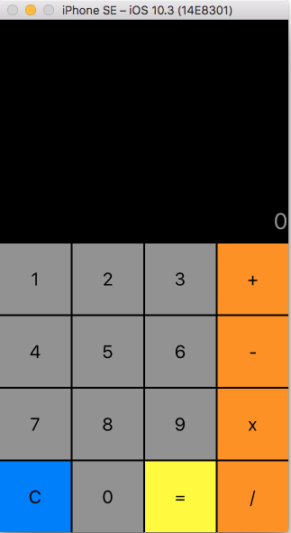
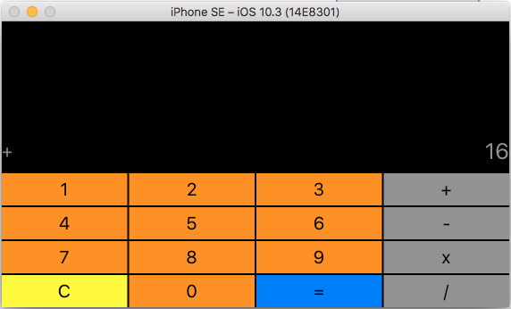

# iOS_Calculator

## First example 

A Swift calculator with a change color during the rotation.

Soon iphone7  screen shot.

### ScreenShot 

<h4>Portrait view on iPhone SE </h4>
  
  
<h4>Landscape view on iPhone SE </h4>
  

